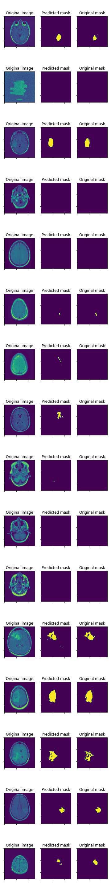

# Brain Tumor Segmentation

This notebook tries to solve brain tumor segmentation problem by implementing and training U-Net.

## Implementation

As stated before, this problem is solved by implementing U-Net (popular architecture for semantic segmentation).

To make the model train better early stopping, learning rate schedulers and weight decay are also implemented.

The model received the MRI scan of the brain and produces a mask of the tumor. 

## Dataset

The model is trained on the Brain MRI Segmentation dataset, which contains MRI scans of the brain and tumor masks.

You can get the original dataset [here](https://www.kaggle.com/mateuszbuda/lgg-mri-segmentation).

## Results

Current model with early stopping trains for around 50 epochs and achieves dice score of around 0.67.

You can get the best model parameters [here](https://drive.google.com/file/d/1-9iR-Gpw6zFNwr85a8Hmnn2oYk_Zr2_Z/view?usp=sharing);

Here you can see the example output:

